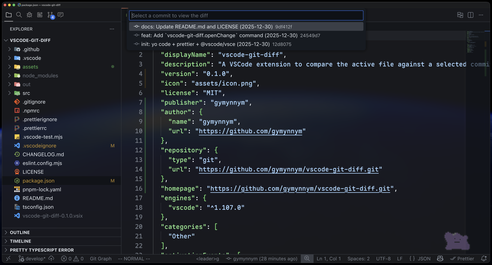

# vscode-git-diff



[](https://github.com/gymynnym/vscode-git-diff/releases/latest)
[](https://marketplace.visualstudio.com/items?itemName=gymynnym.vscode-git-diff)

**A VSCode extension to compare the active file against a selected commit from history. (similar to JetBrains IDEs' `Compare.Selected` action)**

### Installation

There are 2 ways to install this extension:

1. Install from the [Visual Studio Code Marketplace](https://marketplace.visualstudio.com/items?itemName=gymynnym.vscode-git-diff)
2. Download VSIX file from [GitHub Releases](https://github.com/gymynnym/vscode-git-diff/releases/latest)

### Commands

- `vscode-git-diff.openChange` : Open Git Diff with commit selection

### Keybindings

#### VSCodeVim Keybindings: for nerds (Example)

```json
{
  "vim.normalModeKeyBindingsNonRecursive": [
    {
      "before": ["space", "g", "d"],
      "commands": [{ "command": "vscode-git-diff.openChange" }] // Git diff with commit selection
    },
    {
      "before": ["space", "g", "D"],
      "commands": [{ "command": "git.openChange" }] // Default git diff
    }
  ]
}
```
